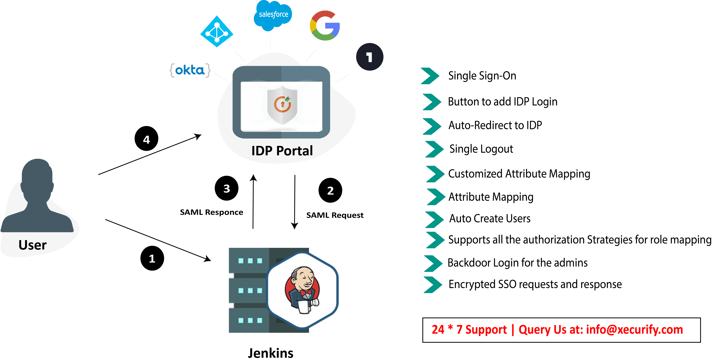
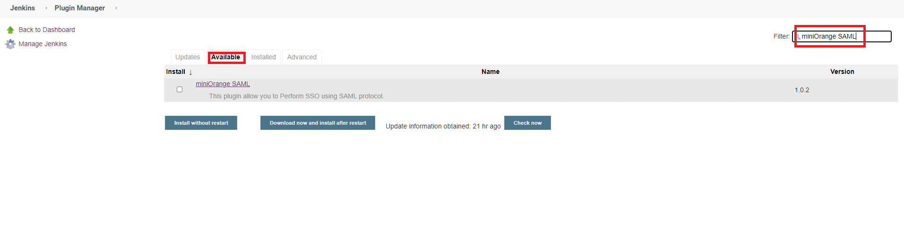
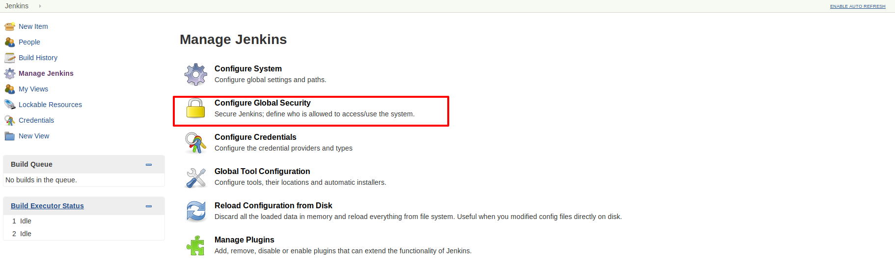

# SAML Single Sign On (SSO) for Jenkins


 ⭐  **Click [here](https://miniorange.atlassian.net/wiki/spaces/JSDoc/pages/2551251014/Jenkins+SAML+SSO+Premium+Version+Payment+Steps) to try out the premium plugin for free** ⭐

**SAML Single Sign On (SSO) for Jenkins** plugin allows SSO with ADFS, Azure AD, Azure AD B2C, Keycloak, Okta, Shibboleth, Salesforce, GSuite / Google Apps, AWS, Office 365, SimpleSAMLphp, OpenAM, Centrify, Ping, RSA, IBM, Oracle, OneLogin, Bitium, WSO2, Auth0, AuthAnvil and all SAML 2.0 capable Identity Providers to securely authenticate the users into Jenkins.

**Features of Jenkins Saml SP Plugin**

* Simple and easy-to-use [ FREE ]
* Supports both SSO and Jenkins’ own login at the same time [FREE]
* Auto Create Users[FREE]
* Supports all the authorization strategies for role/group mapping[FREE]
* Encrypted SSO requests and response[FREE]
* Support to the Proxy Setup [FREE]
* Attribute Mapping[PREMIUM]
* Auto-redirect to IdP[ PREMIUM ]
* Custom Attribute Mapping [PREMIUM]
* Just In Time Group/Role Provisioning [PREMIUM]
* Manual Group/Role Mapping [PREMIUM]
* 24*7 support [PREMIUM]
* Back-door Login [PREMIUM]
* Single Logout [PREMIUM]

Facing issue with SSO? Refer below steps to generate error Logs and send it to info@xecurify.com. We will help you resolve your issue in no time.

### **[Frequently Asked Questions](https://faq.miniorange.com/kb/jenkins/)**

Looking for **Two Factor Authentication(2FA)/OAuth Single Sign On (SSO)** for Jenkins ? Contact us at info@xecurify.com for more details.

Supported IDP’s:

If you require Jenkins SAML Single Sign On (SSO) application or need any help with installing this plugin, please feel free to email us at info@xecurify.com.


LIST OF SUPPORTED IDPS:
* [Azure AD](https://plugins.miniorange.com/saml-single-sign-on-sso-into-jenkins-using-azure-ad-as-idp) (supports SAML SSO for Jenkins login)
* [Keycloak](https://plugins.miniorange.com/saml-single-sign-on-sso-into-jenkins-using-jboss-keycloak-as-idp) (supports SAML SSO for Jenkins login)
* [ADFS](https://plugins.miniorange.com/saml-single-sign-on-sso-into-jenkins-using-adfs-as-idp) (supports SAML SSO for Jenkins login)
* [Okta](https://plugins.miniorange.com/saml-single-sign-on-sso-into-jenkins-using-okta-as-idp) (supports SAML SSO for Jenkins login)
* [Salesforce](https://plugins.miniorange.com/saml-single-sign-on-sso-into-jenkins-using-salesforce) (supports SAML SSO for Jenkins login)
* [Shibboleth 2](https://plugins.miniorange.com/saml-single-sign-on-sso-into-jenkins-using-shibboleth2) (supports SAML SSO for Jenkins login)
* [GSuite / Google Apps](https://plugins.miniorange.com/saml-single-sign-on-sso-into-jenkins-using-google-apps-g-suite-as-idp) (supports SAML SSO for Jenkins login)
* [miniOrange](https://plugins.miniorange.com/saml-single-sign-on-sso-into-jenkins-using-miniorange-as-idp) (supports SAML SSO for Jenkins login)
* [OneLogin](https://plugins.miniorange.com/saml-single-sign-on-sso-into-jenkins-using-onelogin-as-idp) (supports SAML SSO for Jenkins login)
* [Centrify](https://plugins.miniorange.com/saml-single-sign-on-sso-into-jenkins-using-centrify-as-idp) (supports SAML SSO for Jenkins login)
* [SimpleSAMLphp](https://plugins.miniorange.com/saml-single-sign-on-sso-into-jenkins-using-simplesaml) (supports SAML SSO for Jenkins login)
* [OpenAM](https://plugins.miniorange.com/saml-single-sign-on-sso-into-jenkins-using-openam-as-idp) (supports SAML SSO for Jenkins login)
* [PingOne](https://plugins.miniorange.com/saml-single-sign-on-sso-into-jenkins-using-ping-one) (supports SAML SSO for Jenkins login)
* [RSA](https://plugins.miniorange.com/saml-single-sign-on-sso-into-jenkins-using-rsa-securid) (supports SAML SSO for Jenkins login)
* [Oracle](https://plugins.miniorange.com/saml-single-sign-on-sso-into-jenkins-using-oracle-enterprise-manager) (supports SAML SSO for Jenkins login)
* [Bitium](https://plugins.miniorange.com/saml-single-sign-on-sso-into-jenkins-using-bitium-as-idp) (supports SAML SSO for Jenkins login)
* [WSO2](https://plugins.miniorange.com/saml-single-sign-on-sso-into-jenkins-using-wso2) (supports SAML SSO for Jenkins login)
* [Auth0](https://plugins.miniorange.com/saml-single-sign-on-sso-into-jenkins-using-auth0-as-idp) (supports SAML SSO for Jenkins login)
* [AuthAnvil](https://plugins.miniorange.com/saml-single-sign-on-sso-into-jenkins-using-authanvil-as-idp) (supports SAML SSO for Jenkins login) 
 
   and practically any SAML compliant Identity Provider.
 
 
In addition to the above, [miniOrange](/docs/images/miniorange_as_idp.md) also provides On-Premise IDP. 
 
 
SAML Single Sign-on (SSO) acts as a SAML 2.0 Service Provider and securely authenticates users with your SAML 2.0 Identity Provider.

## On Jenkins side:

**Step 1: Download and install the plugin in Jenkins.**

To download the miniorange saml SP plugin follow the path:
**Through Jenkins plugin directory**
* Login to your Jenkins.
* Go to **Manage Jenkins** option from the left pane, and open **Manage Plugins** tab.


* Search for ‘**Miniorange saml**’ in the available tab.
  
* Download and install with a restart.


Or
**Manual Configuration:**
* Login to your Jenkins.
* Go to **Manage Jenkins** option from the left pane, and open **Manage Plugins** tab.
* Go to the **advanced** tab and upload the hpi file.
* You can get the hpi file by running ```mvn clean package``` command on this code. Contact info@xecurify.com if you are facing any issue.


**Step 2: To activate the plugin**

* Open **Manage Jenkins** => **Configure Global Security** and set the **Security Realm** as **miniorange SAML 2.0**.



            Make sure that Enable Security checkbox is checked.
            


**Step:3:** Fill the required details of IDP and press apply and save the settings.
* Fill the required details of IDP and press apply and save the settings.


